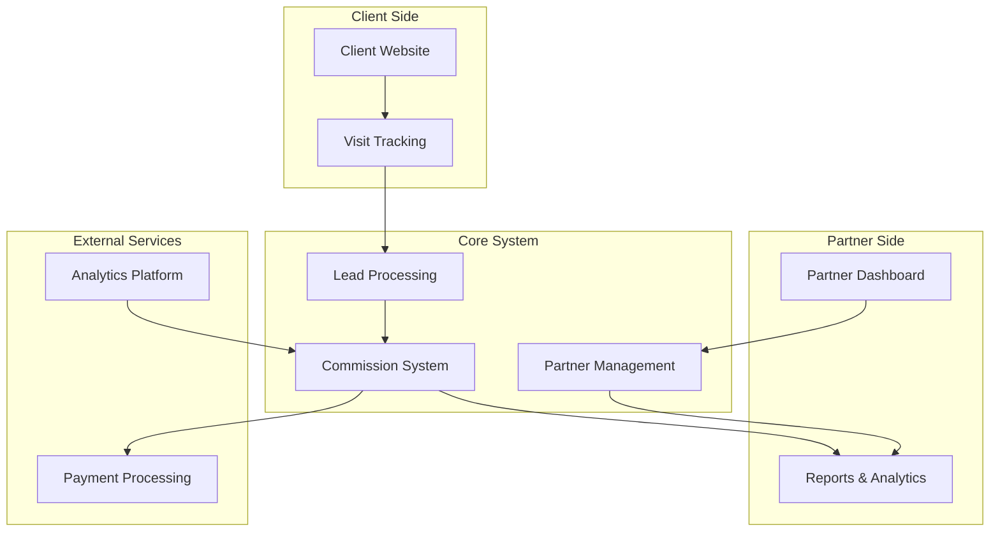
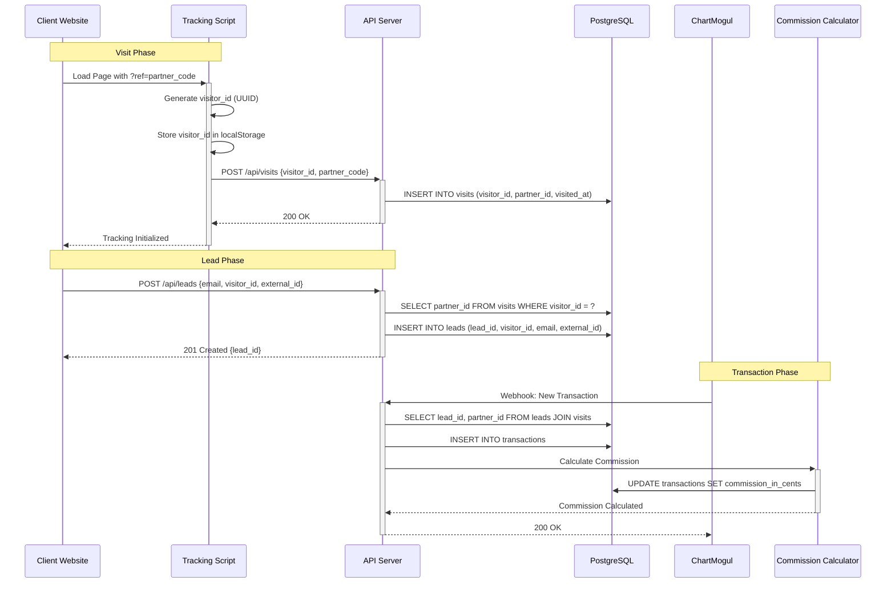
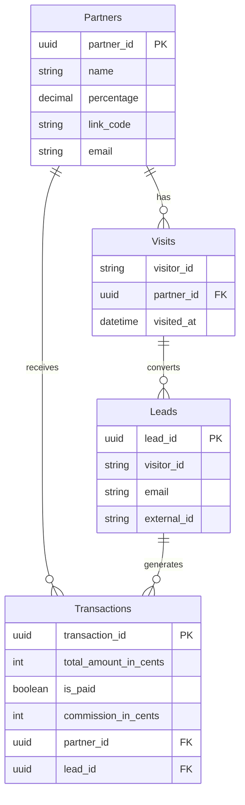

# Partner Program System Diagrams

## System Flow Diagram

```mermaid
flowchart TD
    subgraph Partner Side
        PP[Partner Dashboard]
        Reports[Reports & Analytics]
    end

    subgraph Client Side
        Website[Client Website]
        Tracking[Visit Tracking]
    end

    subgraph Core System
        Management[Partner Management]
        Leads[Lead Processing]
        Commission[Commission System]
    end

    subgraph External Services
        Payments[Payment Processing]
        Analytics[Analytics Platform]
    end

    PP --> Management
    Website --> Tracking
    Tracking --> Leads
    Leads --> Commission
    Commission --> Reports
    Analytics --> Commission
    Commission --> Payments
    Management --> Reports
```

## Technical Lead Flow

```mermaid
sequenceDiagram
    participant CW as Client Website
    participant TS as Tracking Script
    participant API as API Server
    participant DB as PostgreSQL
    participant CM as ChartMogul
    participant CALC as Commission Calculator

    Note over CW,TS: Visit Phase
    CW->>+TS: Load Page with ?ref=partner_code
    TS->>TS: Generate visitor_id (UUID)
    TS->>TS: Store visitor_id in localStorage
    TS->>+API: POST /api/visits {visitor_id, partner_code}
    API->>DB: INSERT INTO visits (visitor_id, partner_id, visited_at)
    API-->>-TS: 200 OK
    TS-->>-CW: Tracking Initialized

    Note over CW,API: Lead Phase
    CW->>+API: POST /api/leads {email, visitor_id, external_id}
    API->>DB: SELECT partner_id FROM visits WHERE visitor_id = ?
    API->>DB: INSERT INTO leads (lead_id, visitor_id, email, external_id)
    API-->>-CW: 201 Created {lead_id}

    Note over CM,CALC: Transaction Phase
    CM->>+API: Webhook: New Transaction
    API->>DB: SELECT lead_id, partner_id FROM leads JOIN visits
    API->>DB: INSERT INTO transactions
    API->>+CALC: Calculate Commission
    CALC->>DB: UPDATE transactions SET commission_in_cents
    CALC-->>-API: Commission Calculated
    API-->>-CM: 200 OK
```

## Database Schema

```mermaid
erDiagram
    Partners ||--o{ Visits : has
    Partners ||--o{ Transactions : receives
    Visits ||--o{ Leads : converts
    Leads ||--o{ Transactions : generates

    Partners {
        uuid partner_id PK
        string name
        decimal percentage
        string link_code
        string email
    }

    Visits {
        string visitor_id
        uuid partner_id FK
        datetime visited_at
    }

    Leads {
        uuid lead_id PK
        string visitor_id
        string email
        string external_id
    }

    Transactions {
        uuid transaction_id PK
        int total_amount_in_cents
        boolean is_paid
        int commission_in_cents
        uuid partner_id FK
        uuid lead_id FK
    }
``` 